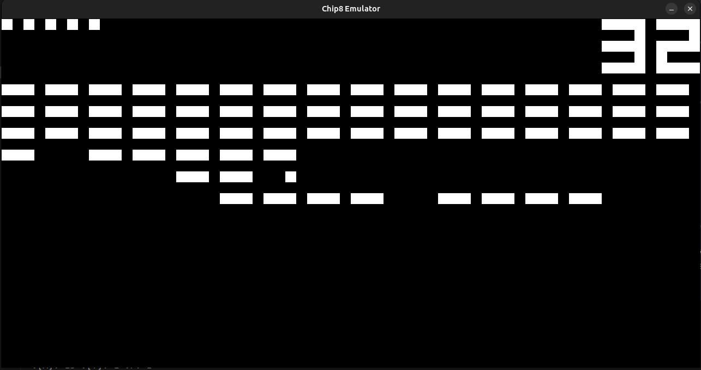
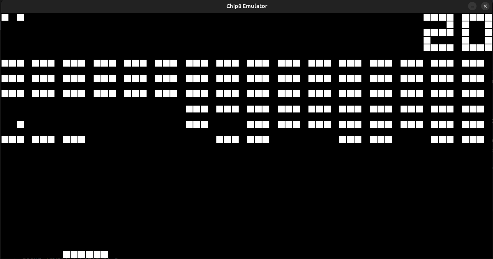

# CHIP-8 Emulator

This project accurately emulates the original CHIP-8 system, which was the Chip8 Interpreter on the 1802 microprocessor, where games like Pac-Man, Tetris, Space Invaders, and Pong were born, written in C++17 using SDL2.  

| Brix Game Non Pixelated | Brix Game Pixelated |
|:-----------------------:|:-------------------:|
|  |  |

---

## Features

- **Full CHIP-8 instruction set** (all 35 opcodes implemented)
- **Accurate graphics** (64x32 monochrome display, pixel scaling, optional outlines)
- **Configurable CPU speed** (default: 700 Hz, adjustable)
- **Precise timers** (delay and sound timers run at 60 Hz)
- **Sound** (square wave audio using SDL2 audio callback)
- **Keyboard input** (maps QWERTY keys to CHIP-8 hex keypad)
- **ROM hot-reload** (press `L` to reload the current ROM)
- **Pause/Resume** (press `Space` to pause/resume emulation)
- **Increase/Decrease Volume** (press `O` and `P` to increase/decrease volume)
- **Clean, modern C++ codebase** (RAII, smart pointers, type-safe containers)

---

## Technologies Used

- **C++17** (modern language features, `std::array`, smart pointers, etc.)
- **SDL2** (window management, graphics, keyboard input, audio)
- **Standard C++ STL** (`<array>`, `<memory>`, `<chrono>`, `<iostream>`, etc.)

---

## Key Bindings

| CHIP-8 Key | Keyboard Key |
|:----------:|:------------:|
| 1 2 3 C    | 1 2 3 4      |
| 4 5 6 D    | Q W E R      |
| 7 8 9 E    | A S D F      |
| A 0 B F    | Z X C V      |

**Special keys:**
- `Space` - Pause/Resume
- `Esc` - Quit emulator
- `L` - Reload current ROM
- `O`/`P` - Increase/Decrease volume

---

## How to Build

### **Dependencies**

- **SDL2** (development headers and runtime)
- **C++17 compatible compiler** (e.g., g++, clang++)

### **Build Instructions**

- **git clone** (your repo url)
- **cd** (to your repo directory)
- **make** (`For debug build`)
- **make release** (`For optimized release build`)

---

## How to Run

./chip8 path/to/your_rom.ch8

- The emulator window will open and run the ROM.
- Use the mapped keys for input.
- Press `Esc` to quit, `Space` to pause/resume, and `L` to reload the ROM.

---

## Configuration

Edit `Config.hpp` to change:
- Window scaling (`scale_factor`)
- Foreground/background colors (`fg_color`, `bg_color`)
- CPU speed (`ints_per_second`)
- Sound frequency and volume (`square_wave_freq`, `volume`)

---

## Tested ROMs

- [x] BC_test.ch8 (opcode test)
- [x] test_opcode.ch8 (opcode test)
- [x] Various public domain CHIP-8 games

---

## Credits

- [Queso Fuego's Youtube Tutorial in C](https://youtu.be/YvZ3LGaNiS0?si=xfOLVWfA1dGCN4lC)
- [CHIP8 Wikipedia page](https://en.wikipedia.org/wiki/CHIP-8)
- [SDL2 library and documentation](https://wiki.libsdl.org/SDL2/APIByCategory)

---

## TODO / Ideas

- Super CHIP-8 and SCHIP support
- Configurable key mapping via file
- Save/load state
- Debugger/step mode

---

**Enjoy running classic CHIP-8 games on this C++ emulator!**